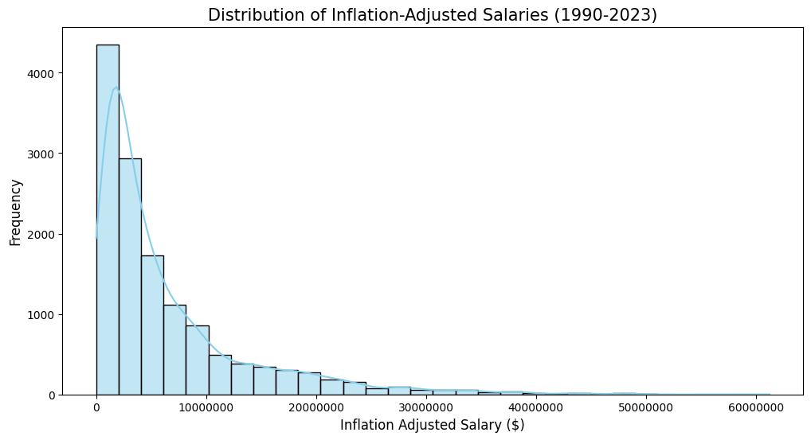
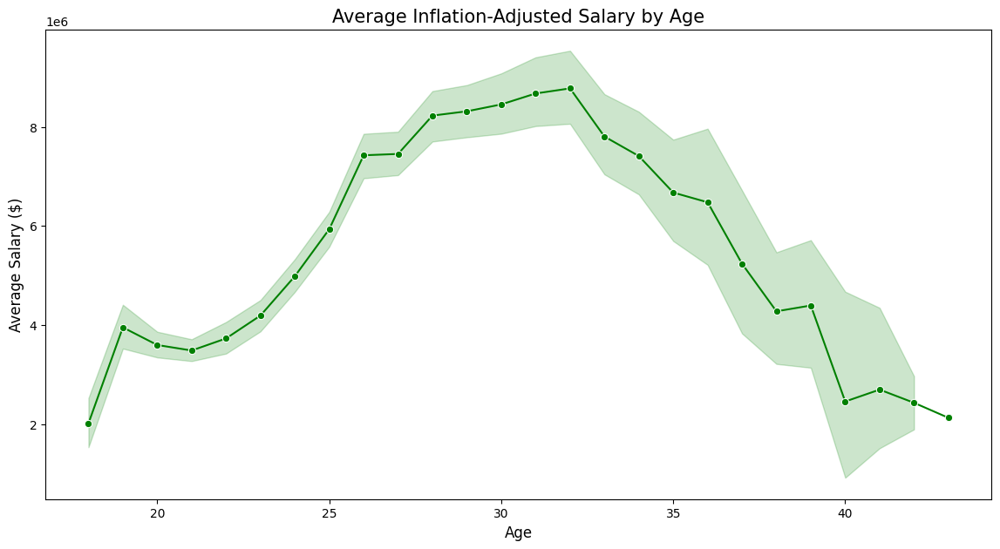
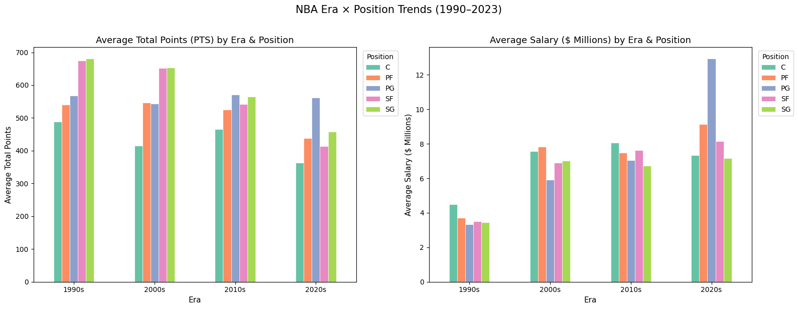
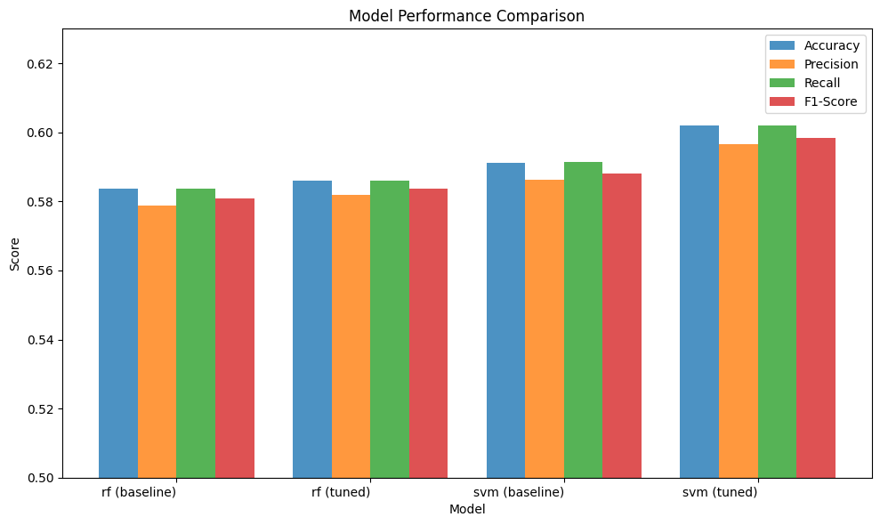

# NBA Salaries Aren't About Efficiency
### The Roles of Age, Experience, and Scoring Variability (1990–2023)

---

## Slide 1: Introduction

**The Question**
Do NBA players get paid for how efficiently they play, or for something else entirely?

**Why It Matters**
NBA teams spend hundreds of millions of dollars on player contracts each year. Understanding what actually drives salary can reveal whether the market is rational or whether teams are paying for the wrong things.

**What We Did**
Across three parts, we merged historical player statistics with salary records, ran statistical tests to answer three research questions, and built machine learning models to predict salary tiers from performance data alone.

---

## Slide 2: The Data

**Two datasets, merged into one**

| Dataset | Coverage | Key Fields |
|---|---|---|
| NBA Player Box Score Stats | 1950–2022 | Points, FG%, FT%, Age, Position, Minutes |
| NBA Player Salaries | 1990–2023 | Salary, Inflation-Adjusted Salary |

**After merging and cleaning:**
- 13,604 player-seasons (1990–2022)
- No missing values
- Salaries adjusted for inflation so every era is comparable

**Key preprocessing challenges**
- Only ~48% of player-seasons had a matching salary record; we used a left join (stats as the base) to keep the full performance record and treat salary as an enrichment
- Player names and season year formats differed across datasets, requiring standardization before merging
- 518 duplicate rows removed before modeling

---

## Slide 3: Exploratory Findings (Part 1)

**Salary is right-skewed: a few players earn far more than everyone else**

**Scoring volume is the strongest individual predictor of salary**
- PTS vs. salary correlation: **r = 0.51**
- FG% vs. salary correlation: **r ≈ 0.06** (near zero)

**Age and salary follow a curve, not a line**

**Early takeaway:** Scoring volume stats matter more than efficiency in relation to salary.

---

## Slide 4: Statistical Analysis — Three Research Questions (Part 2)

**RQ1: Does a higher salary guarantee better shooting efficiency?**
No. Field goal percentage explains just **1.9% of salary variance** (R² = 0.019). The average prediction error when using FG% alone is **$7.2 million**, effectively useless.

**RQ2: Does age affect salary?**
Yes, significantly (ANOVA p < 0.0001). But the relationship is non-linear:
- Rookies (under 24): **$3.86M** average, capped by rookie-scale contracts
- Prime (24–29): **$6.92M**, first major free-agent deals
- Veterans (30+): **$7.95M**, survivorship effect; only elite players remain

**RQ3: Do consistent scorers earn more?**
No, the opposite is true. Players with *high scoring variability* earn **$7.71M** on average, versus **$3.08M** for consistent scorers. High variability signals a high-usage star player; steady but modest output signals a role player.

---

## Slide 5: A Changing League (Part 2 — Comparative Analysis)

**NBA salaries have more than doubled since the 1990s, even after inflation**

| Era | Average Inflation-Adjusted Salary |
|---|---|
| 1990s | $3.71M |
| 2010s | $7.37M |

This doubling was driven by the league's global expansion and massive TV broadcast rights deals, not just economic inflation.

**Scoring has actually *declined* over the same period**
- 1990s average season points: 587
- 2010s average season points: 534

Players are earning more while scoring less per season: consistent with deeper benches and a faster pace replacing individual volume.

---

## Slide 6: Machine Learning — Can Stats Predict Salary Tier? (Part 3)

**Setup**
We converted inflation-adjusted salary into three equal tiers (Low / Mid / High) and trained models to classify players based on their stats alone.

**Why three tiers?**
A 3-class problem where random guessing scores 33% gives us a clear benchmark to beat.

**Models tested**
- Random Forest (baseline + tuned)
- Support Vector Machine (SVM), baseline + tuned

**Key preprocessing decision**
67 features after one-hot encoding were compressed to 10 principal components (PCA) capturing 90% of variance, reducing noise and improving SVM performance.

---

## Slide 7: Machine Learning — Results (Part 3)

**Best model: Tuned SVM, 60.2% accuracy**

| Model | Accuracy |
|---|---|
| Random guessing | 33% |
| RF baseline | 58.4% |
| SVM baseline | 59.1% |
| RF tuned | 58.6% |
| **SVM tuned** | **60.2%** |

The tuned SVM is **~80% better than random chance**, but still misclassifies 40% of players.

**What the model learned**
- PC1 (scoring volume: PTS, FG, FGA, minutes) is the single most important predictor
- PC5 (games played, free-throw %, minutes) ranks second; durability matters more than shooting efficiency
- The **Mid tier is the hardest to classify** (F1 = 0.46 vs. 0.68 for High and 0.65 for Low), because the middle bracket mixes underpaid stars on rookie deals with overpaid veterans

---

## Slide 8: Conclusions and Implications

**What we confirmed**
- NBA teams do *not* pay for shooting efficiency: FG% is nearly irrelevant to salary across every analysis method we used
- Scoring *volume* and *playing time* are the dominant salary drivers, confirmed by both regression (r = 0.51 for PTS) and machine learning (PC1 dominates feature importance)
- The age-salary curve reflects a structural market: rookie contracts suppress earnings for young players regardless of performance

**What surprised us**
- Consistent scorers earn *less* than variable ones: high variability is a marker of star usage, not unreliability
- Even after inflation adjustment, average salaries doubled from the 1990s to the 2010s, while scoring per player *fell*
- A 40% classification error persisted across all models despite extensive tuning, pointing to a hard ceiling imposed by non-statistical factors: contract type, team payroll situation, market size, and player marketability

**The bottom line**
Stats explain *who plays a lot* and *who scores a lot* and those two things correlate with salary. But the full picture of what a player earns requires context that box scores alone cannot capture.
